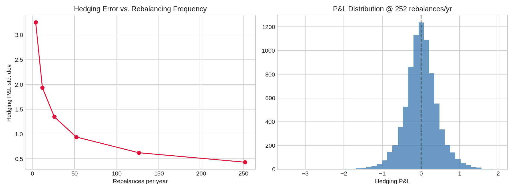
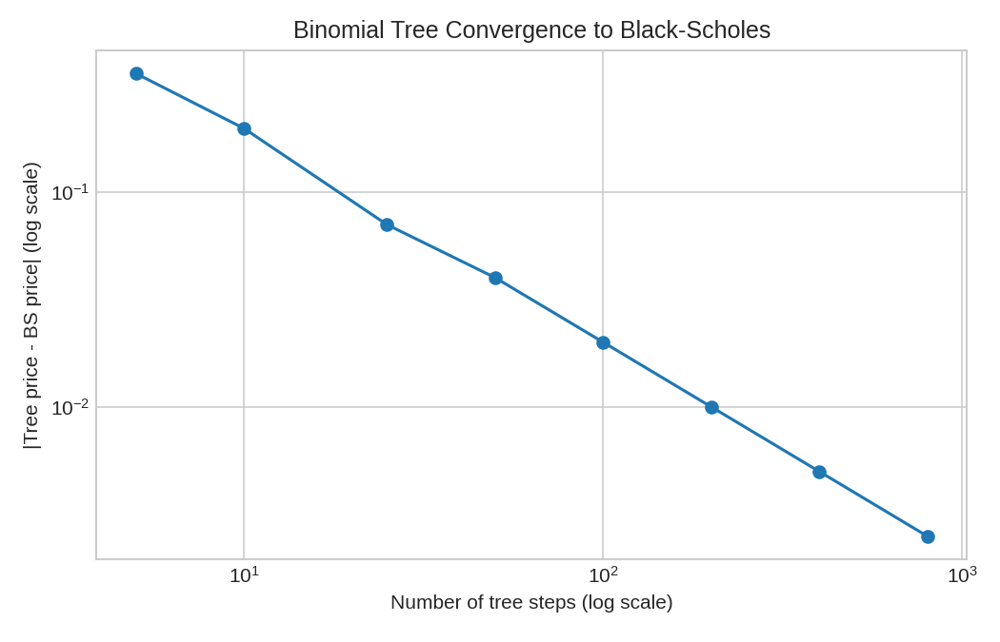
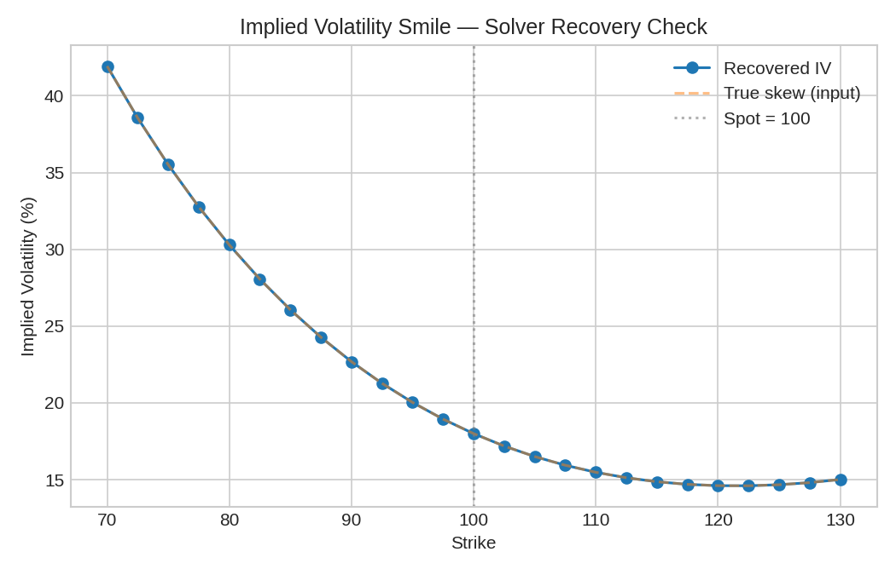
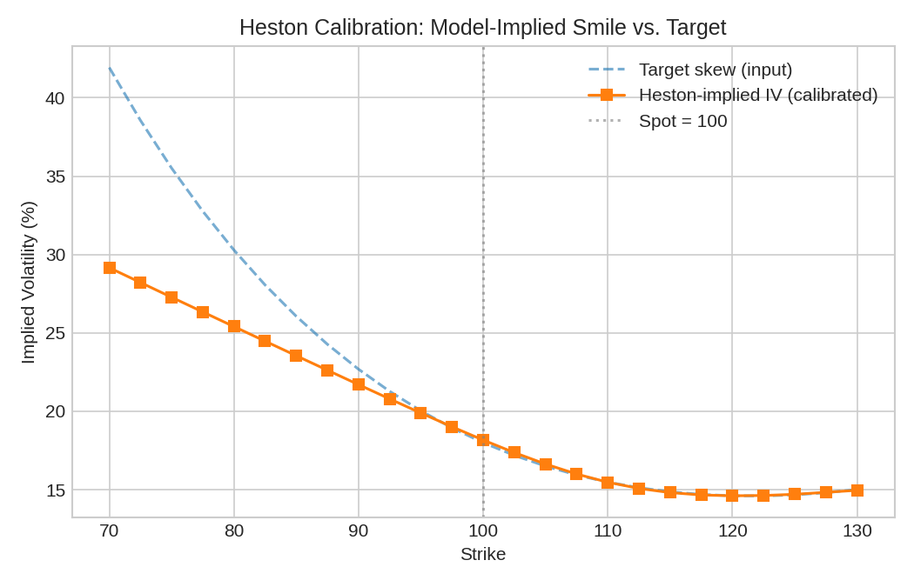
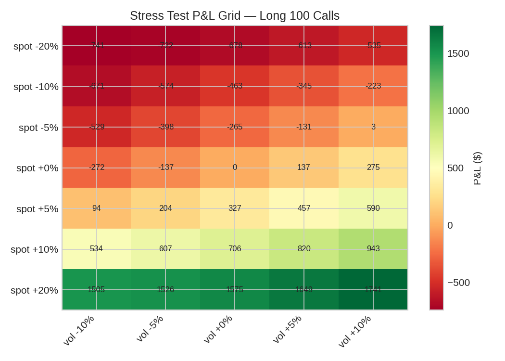
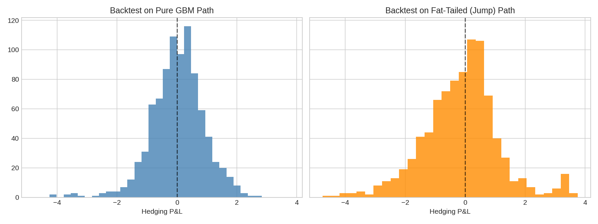

# VolEdge

[](https://github.com/rishabhsatishjain7/voledge/actions/workflows/tests.yml)

A European options pricing and hedging engine: Black-Scholes, a CRR binomial
tree, and Monte Carlo pricers cross-validated against each other; an implied
volatility solver with a robust fallback for low-vega strikes; and a
delta-hedging simulation that quantifies discretization error as a function
of rebalancing frequency.

**Headline result:** delta-hedging error (P&L std. dev. at expiry) falls
monotonically as rebalancing frequency increases, from **3.26** at 4
rebalances/year down to **0.43** at 252 (daily) — while mean P&L stays flat
near zero throughout, confirming the simulation captures a variance effect,
not a directional edge.



**Live demo:** [Streamlit app link — pick a ticker, see the live IV smile, run the hedging simulator]

---

## Methodology

- **Black-Scholes** (`src/pricing/black_scholes.py`) is the baseline
  closed-form European pricer, implemented from the formula directly
  (no external stats library — the normal CDF is built on `math.erf`).
- **Binomial tree** (`src/pricing/binomial_tree.py`) is a CRR tree used two
  ways: as a convergence check against Black-Scholes (see plot below), and
  as an American-exercise pricer, since American options have no
  closed-form solution and this is exactly where a tree earns its keep.
- **Monte Carlo** (`src/pricing/monte_carlo.py`) simulates terminal prices
  directly under GBM (European payoffs only depend on S_T, so no need to
  simulate full paths), with antithetic variates for variance reduction.
- **Implied volatility** (`src/implied_vol.py`) inverts Black-Scholes via
  Newton-Raphson (fast, ~5 iterations when it converges), falling back to
  bisection/Brent for low-vega deep ITM/OTM strikes where Newton-Raphson's
  derivative-based updates become unstable.
- **Delta hedging** (`src/hedging.py`) simulates selling an option and
  dynamically rehedging its delta exposure under GBM, financing the cash
  difference at the risk-free rate, to measure how discrete rebalancing
  error compares to the idealized continuous-time hedge.
- **Heston stochastic volatility** (`src/pricing/heston.py`) addresses
  the constant-vol assumption directly: the smile above is empirical
  proof that a single sigma doesn't fit the market, so Heston lets
  variance itself follow a mean-reverting stochastic process correlated
  with the asset's returns. Priced via the classical Heston (1993)
  semi-closed-form (two probabilities recovered by numerical integration
  of their characteristic functions, "Little Trap" formulation for
  numerical stability), calibrated to a market price set via bounded
  least-squares.
- **Risk metrics** (`src/risk.py`) computes 1-day VaR two ways -
  delta-normal (fast, linearizes P&L via delta) and Monte Carlo full
  revaluation (slower, captures gamma and payoff convexity) - compared
  directly against each other, plus a scenario stress-test grid (P&L
  under named spot/vol shocks, independent of any distributional
  assumption).
- **Historical backtest** (`src/backtest.py`) addresses a gap the
  Monte Carlo hedging simulation can't close on its own: that simulation
  tests the hedging strategy's *mechanics* against paths generated under
  the same GBM model used to compute delta, which proves the
  implementation is correct but says nothing about real markets, which
  have volatility clustering and fat tails GBM doesn't capture. This
  module replays the identical hedging strategy against real historical
  daily prices via a rolling-window backtest: at each window's inception,
  volatility is estimated only from data strictly before that point (no
  lookahead bias), then the position is delta-hedged through the real
  subsequent price path. The Streamlit app's Historical Backtest tab
  compares the resulting real-market P&L distribution directly against a
  GBM simulation using the same average vol - the ratio between the two
  standard deviations is a direct, visible measure of the "model risk"
  GBM leaves on the table.

All three pricers agree closely on a plain-vanilla ATM call
(S=K=100, T=1, r=5%, σ=20%): Black-Scholes **10.4506**, binomial tree
(500 steps) **10.4466**, Monte Carlo (200k paths) **10.4763 ± 0.0649**
(95% CI) — the closed-form price sits inside the MC confidence interval,
and the tree converges to it as step count grows.

## Results

### Binomial tree convergence to Black-Scholes

As tree depth increases, the CRR price converges to the closed-form
Black-Scholes price at the expected rate:



### Implied volatility smile

The IV solver recovers a known parametric skew (used here as a
reproducible, offline stand-in for a live chain — see Limitations) across
25 strikes with a max absolute error of **2e-6**, including the low-vega
tails that force the Brent fallback:



### Delta-hedging error vs. rebalancing frequency

| Rebalances/yr | Std. dev. (hedging error) | Mean P&L |
|---:|---:|---:|
| 4   | 3.2599 | -0.0480 |
| 12  | 1.9353 | -0.0390 |
| 26  | 1.3500 | -0.0183 |
| 52  | 0.9408 | -0.0012 |
| 126 | 0.6234 | -0.0027 |
| 252 | 0.4318 | +0.0060 |

### Heston calibration to the smile

Calibrating Heston to the same target skew above recovers a smile of
similar shape (RMSE = **0.1228** in price units across 25 strikes ranging
$0.001-$31), without being told the functional form in advance - the
calibrated parameters (v0=0.0057, kappa=20.0, theta=0.0431, sigma_v=1.43,
rho=-0.612) show the expected negative spot-vol correlation:



`kappa` calibrating to its upper bound is itself informative: it's the
fit signaling that this specific quadratic target skew isn't exactly
representable by Heston's 5-parameter functional form - see Limitations.

### Risk: VaR and stress testing

1-day 95% VaR for a long 100-contract ATM call, computed two ways:

| Method | VaR | CVaR |
|---|---:|---:|
| Parametric (delta-normal) | 112.56 | 141.15 |
| Monte Carlo (full revaluation) | 109.24 | 134.40 |

The two methods agree within **3.0%** at this short horizon, where
convexity effects are small - a real risk desk would expect this level of
agreement and get suspicious of a larger gap.



### Historical backtest: model risk made visible

Replaying the identical delta-hedging strategy against a synthetic
fat-tailed (jump-diffusion) path instead of pure GBM produces **1.42x**
the hedging error (std. dev. 1.2552 vs. 0.8844) at the same rebalancing
frequency and average vol assumption — direct, quantified evidence of
what a GBM-only simulation structurally cannot show: a hedger's real
residual risk when the market doesn't move the way the model assumes.



The live Streamlit tab runs this same comparison against real historical
prices for any ticker — the notebook's version above uses a synthetic
path specifically so the result is reproducible offline (see Limitations
for why real historical options data isn't used here).

## Repo structure

```
voledge/
├── .github/workflows/tests.yml   # CI: pytest + notebook re-execution on every push
├── README.md
├── src/
│   ├── pricing/
│   │   ├── black_scholes.py
│   │   ├── binomial_tree.py
│   │   ├── monte_carlo.py
│   │   └── heston.py
│   ├── greeks.py
│   ├── implied_vol.py
│   ├── hedging.py
│   ├── backtest.py
│   ├── risk.py
│   └── data.py
├── notebooks/
│   └── analysis.ipynb        # generates every plot in this README
├── tests/
│   └── test_pricing.py       # 36 tests: parity, convergence, boundaries, Greeks, IV, Heston, VaR/stress, backtest
├── streamlit_app.py           # live demo: 5 tabs (smile, hedging, Heston, risk, historical backtest)
├── requirements.txt
└── LICENSE
```

Pricing logic lives in tested, importable modules under `src/` — notebooks
are for analysis and plots, not where the math lives. That split is
deliberate: it's what makes the pricers reusable by the Streamlit app,
the test suite, and (if you fork this) anything else, instead of being
locked inside one notebook.

## Running it

```bash
pip install -r requirements.txt

# Run the test suite
pytest tests/ -v

# Regenerate the analysis notebook's outputs and plots
jupyter nbconvert --to notebook --execute --inplace notebooks/analysis.ipynb

# Launch the live demo
streamlit run streamlit_app.py
```

## Limitations

- **European exercise assumption for the Black-Scholes baseline.** American
  early-exercise value is only captured by the binomial tree branch
  (`american=True`), not by the BS, Monte Carlo, or Heston pricers.
- **No discrete dividends.** Dividend yield `q` is modeled as continuous;
  real equities pay discrete dividends that create small jumps the
  continuous-yield approximation doesn't capture, particularly for
  short-dated options around an ex-dividend date.
- **Constant volatility assumption (Black-Scholes/tree/MC).** These
  pricers all assume a single constant σ. The IV smile results (both the
  notebook's synthetic recovery and the live Streamlit tab) are precisely
  a demonstration of where that assumption breaks down against real (or
  realistically-shaped) market prices — the smile itself is evidence the
  constant-vol model is wrong, which is the point of computing it.
- **Heston is a specific functional form, not a universal fit.** Heston
  has 5 free parameters; it cannot match an arbitrary smile shape
  exactly, and the calibration notebook shows a real (small but nonzero)
  residual against the target skew. `kappa` calibrating to its upper
  bound in that example is a concrete instance of this: the optimizer is
  telling you the model wants more mean-reversion speed than the bound
  allows to fit this particular curve, meaning Heston's shape doesn't
  perfectly match a quadratic-in-log-moneyness skew. The Feller condition
  (2·kappa·theta > sigma_v²) is also not enforced — it guarantees
  variance stays positive in continuous time, but calibrated parameters
  routinely violate it in practice, and the pricing method used here
  doesn't require it to produce a valid price.
- **Heston calibration is a single-expiry fit.** It calibrates one set of
  parameters to one expiry's smile; it does not jointly calibrate across
  multiple expiries (a full "vol surface" calibration), which is what a
  real desk would need for consistent pricing across maturities.
- **IV solver has no smoothing or surface fit.** Each strike's IV is
  solved independently via Newton-Raphson/Brent on a raw mid-price; there's
  no SVI or spline fit across strikes. A noisy low-volume strike that
  passes the liquidity filters in `data.py` can still produce a
  "converged" but economically noisy IV — nothing here smooths that out.
- **Live data quality (`data.py`).** Yahoo Finance options data can include
  stale last-trade prices, wide bid-ask spreads, and (observed directly
  during development) bid/ask/open-interest fields that come back zeroed
  out for an entire chain even when volume is clearly real. `get_option_chain`
  handles this per-row (falling back to `lastPrice` when bid/ask are
  absent) and filters on trade recency (`max_quote_age_days`, default 3)
  in addition to volume/open-interest/spread — but this is a heuristic
  filter, not a guarantee of quote quality. Thin names, far-dated
  expiries, or same-day (0DTE) expiries can still return few or no
  usable strikes after filtering.
- **Hedging simulation ignores transaction costs by default.** The delta
  rebalancing in `hedging.py` supports a `transaction_cost_bps` parameter,
  but the headline result above uses `0` (frictionless). Real hedging P&L
  is worse than shown here once trading costs are included, especially at
  high rebalancing frequencies where the "shrinking error vs. more
  frequent trading" tradeoff has a real cost side that this default view
  doesn't show.
- **Real-world drift vs. risk-neutral drift.** The hedging and Monte
  Carlo VaR simulations both advance the underlying under the
  risk-neutral measure (drift = r) for simplicity. A real hedger's/risk
  manager's P&L would reflect the underlying's actual real-world drift,
  which need not equal r.
- **VaR is single-position, not portfolio-level.** Both VaR methods in
  `risk.py` price one option position; they don't aggregate correlated
  positions across a book, which is where real VaR calculations get
  materially more complex (covariance matrices, netting, etc.).
- **Stress test grid uses independent spot/vol shocks.** Real market
  crises typically move spot and vol together in a correlated way (spot
  down, vol up), not independently across a full grid — the grid format
  here is deliberately more general/exploratory than a single named
  historical scenario would be.
- **Backtest windows overlap, so they are not independent draws.**
  `backtest.py`'s rolling-window design means window *i* and window
  *i+5* share most of their underlying days — the resulting P&L
  distribution has real autocorrelation the Monte Carlo comparison
  distribution doesn't, and its standard deviation understates true
  sampling uncertainty. Read the real-vs-simulated ratio directionally
  (evidence GBM misses something), not as a literal statistical
  confidence interval.
- **Backtest holds volatility and rate fixed within each window.** The
  vol assumption is re-estimated fresh at each window's inception (using
  only trailing data — no lookahead), but held constant for that whole
  window's hedge, and the risk-free rate is held constant across the
  *entire* historical sample regardless of how long it spans. Real
  hedgers update vol views intra-window and face a rate that actually
  moves over a multi-year sample.
- **Backtest uses trailing realized vol, not the market's own implied
  vol at each historical date.** A live desk hedging in real time would
  see the market's actual implied vol (which can differ meaningfully
  from trailing realized vol, especially around events), but historical
  options-chain data for arbitrary past dates isn't readily available
  through this project's free data source — realized vol is a reasonable
  practical stand-in but is not the same signal a real trading desk would
  condition on.

## License

MIT — see [LICENSE](LICENSE).
